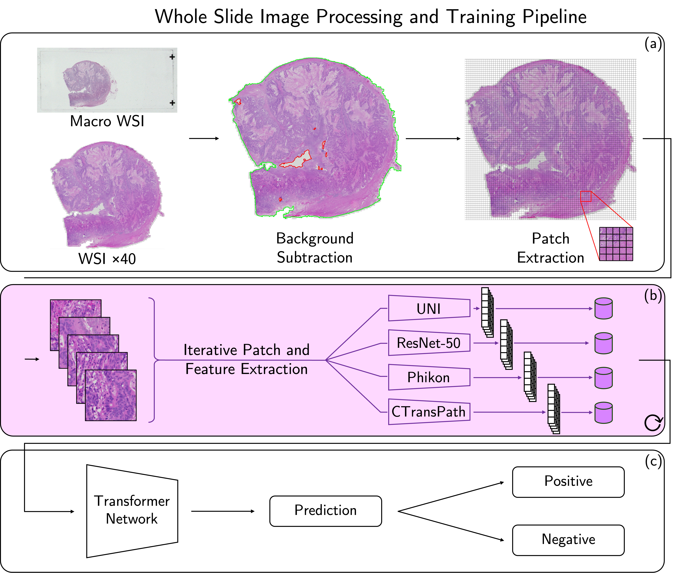

<h1 align="center">
  SurGen-CRC-Arena
</h1>

## Leveraging Foundation Models for Enhanced Detection of Colorectal Cancer Biomarkers in Small Datasets

  [Conference Paper](https://doi.org/10.1007/978-3-031-66955-2_23) | [Open-Access Paper](https://rdcu.be/dPaVZ) | [Dataset](https://doi.org/10.6019/S-BIAD1285) | [Cite](#reference) 

<details>
<summary>Abstract:</summary>
Colorectal cancer is the second leading cause of cancer death worldwide. Its high incidence and mortality rate highlight the critical role of advanced diagnostics and early detection methods. Advancements in computational pathology can significantly enhance diagnostic precision and treatment personalisation, ultimately improving patient outcomes. Hospitals and labs globally are transitioning toward routine whole slide image (WSI) digitisation. This digitisation process generates large volumes of data, offering an opportunity to enhance diagnostic capabilities through the use of machine learning techniques such as weakly supervised learning and self supervised learning (SSL). This study evaluates the performance of state-of-the-art self-supervised learning (SSL) feature extractor foundation models—CTransPath, Phikon, and UNI—against a pretrained ResNet-50, which serves as a benchmark. Our Transformer network analyses these feature vectors, focusing on their efficacy in predicting key colorectal cancer biomarkers within a small dataset containing 423 WSIs with only 8% of cases exhibiting mismatch repair (MMR) deficiency. The CTransPath model achieved the highest validation AUROC of 0.9466 for MMR classification but exhibited a test AUROC of 0.6880, demonstrating significant variability. In contrast, the UNI model demonstrated greater consistency and robustness, achieving a test AUROC of 0.7136, which additionally represents a 6.3% improvement over ResNet-50’s test AUROC of 0.6709. The results highlight the feasibility of using advanced machine learning models with smaller, sparsely annotated datasets, though the variability noted in some models underscores the challenges at the edge of data scarcity.
</details>



## Data

The dataset used in this study can be accesed via [BioImage Archive](https://doi.org/10.6019/S-BIAD1285). Specifically, the SR386 colorecal cohort was utilised for this work.


## Reference
If you find our work useful in your research or if you use parts of this code please consider citing our paper:
```bibtex
@inproceedings{myles2024leveraging,
  title={Leveraging Foundation Models for Enhanced Detection of Colorectal Cancer Biomarkers in Small Datasets},
  author={Myles, Craig and Um, In Hwa and Harrison, David J and Harris-Birtill, David},
  booktitle={Annual Conference on Medical Image Understanding and Analysis},
  doi={10.1007/978-3-031-66955-2_23},
  pages={329-343},
  year={2024},
  organization={Springer}
}

```
